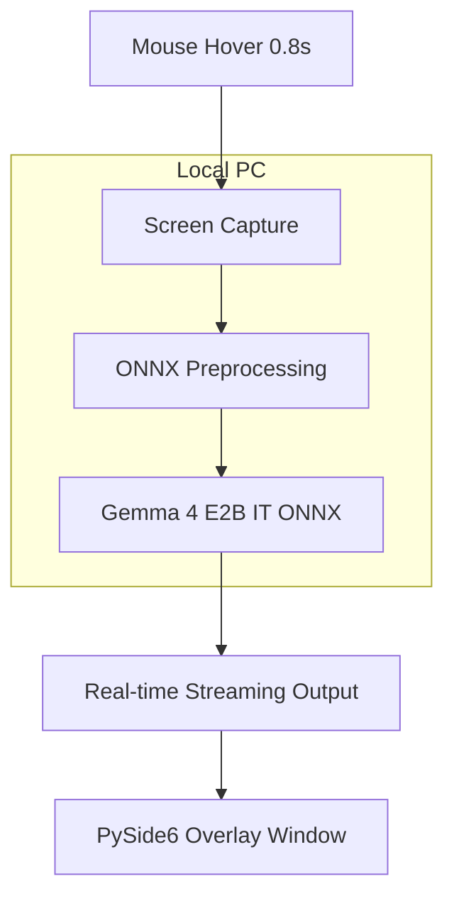

# 🌟 Gemma Glance: Context-Aware Real-Time Knowledge Assistant

[](https://www.kaggle.com/competitions/gemma-4-good-hackathon)
[](https://www.kaggle.com/models/google/gemma-4)
[](https://www.python.org/)
[](https://doc.qt.io/qtforpython-6/)
[](https://onnxruntime.ai/)

> **Harnessing the power of Gemma 4 to drive positive change and global impact.**
> 
> Gemma Glance is a context-aware real-time knowledge assistance tool designed for the **[Gemma 4 Good Hackathon](https://www.kaggle.com/competitions/gemma-4-good-hackathon)**. It provides immediate explanations for difficult terms and concepts on your screen, running entirely locally—even on low-spec educational PCs.

---

## 📝 Project Vision

Gemma Glance bridges the digital divide by providing high-quality AI assistance to everyone, regardless of their hardware or internet stability.

- **Digital Equity**: Brings the power of Gemma 4 to students and the elderly without requiring high-end GPUs.
- **Privacy First**: All data processing and AI inference occur locally. Your screen content never leaves your machine.
- **Seamless UX**: Zero-click interaction allows you to stay focused while getting the information you need.

---

## ✨ Key Features

- 🖱️ **Intelligent Hover Detection**: Automatically detects when you pause your mouse (0.8s) over a complex term.
- 🖼️ **Multimodal Context Analysis**: Captures the surrounding screen area and uses Gemma 4's vision capabilities to understand context.
- ☁️ **Lightweight Overlay**: A beautifully designed, transparent UI that displays explanations without interrupting your workflow.
- ⌨️ **System Integration**: Quick toggle with `Alt+Q` and a convenient system tray menu.
- 🚀 **Optimized for Edge**: Uses **ONNX Runtime (CPU)** with quantized Gemma 4 E2B models for smooth performance on standard PCs.

---

## 🛠 Tech Stack

| Component | Technology | Detail |
| :--- | :--- | :--- |
| **Model** | **Gemma 4 E2B IT** | 2B parameter Edge-optimized model |
| **Inference Engine** | **ONNX Runtime** | CPU-optimized execution |
| **GUI Framework** | **PySide6** | Modern, hardware-accelerated overlay |
| **Model Management**| **kagglehub** | Automated model fetching and versioning |
| **Capture Engine** | **Win32 API / pyautogui**| Low-latency screen capture & mouse tracking |

---

## 🏗 Architecture



---

## 🚀 Getting Started

### Prerequisites
- Windows 10/11
- Python 3.11+
- Kaggle Account (for model download)

### Installation

1. **Clone the repository**:
   ```bash
   git clone https://github.com/your-repo/kaggle-gemma-glance.git
   cd kaggle-gemma-glance
   ```

2. **Setup Virtual Environment**:
   The project is configured to automatically use a `.venv311` directory.
   ```bash
   python -m venv .venv311
   source .venv311/Scripts/activate  # Windows
   pip install -r requirements.txt
   ```

3. **Download the Model**:
   Ensure you have your Kaggle credentials configured.
   ```bash
   python download_model.py
   ```

4. **Run the Application**:
   ```bash
   python main.py
   ```

---

## 🎮 Usage

1. **Activate**: Press `Alt+Q` or use the system tray menu to enable **Analysis Mode**.
2. **Analyze**: Hover your mouse over any text or image you want to understand.
3. **View**: Wait for **0.8 seconds**. A transparent overlay will appear with the explanation.
4. **Dismiss**: Simply move your mouse away to hide the result.

---

## 📅 Roadmap
- [x] Core ONNX Runtime integration for Gemma 4
- [x] Multimodal screen capture logic
- [x] Basic PySide6 overlay UI
- [ ] Improved OCR fallback for low-contrast text
- [ ] Support for multiple languages in explanations
- [ ] Advanced animation effects for the overlay

---

## 📄 License
Distributed under the MIT License. See `LICENSE` for more information.

---

**Built for the [Gemma 4 Good Hackathon](https://www.kaggle.com/competitions/gemma-4-good-hackathon)**
